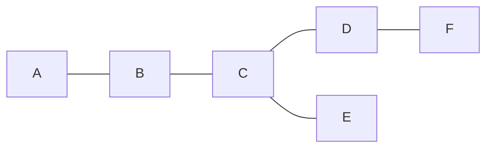
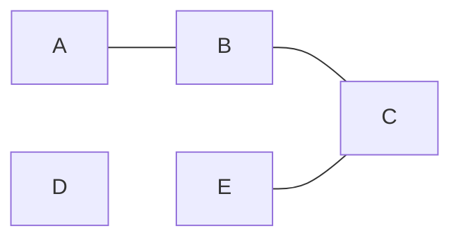
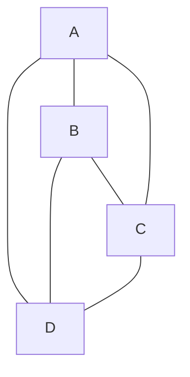
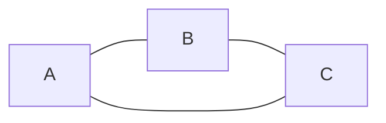
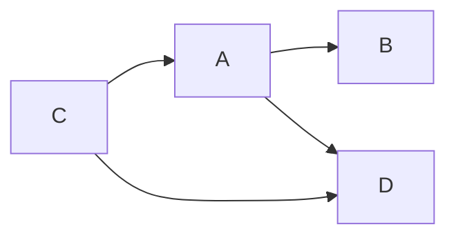
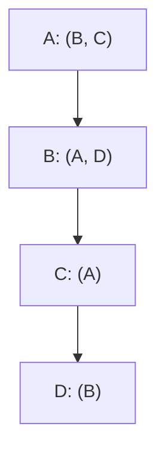
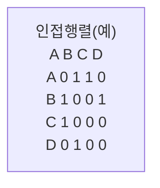
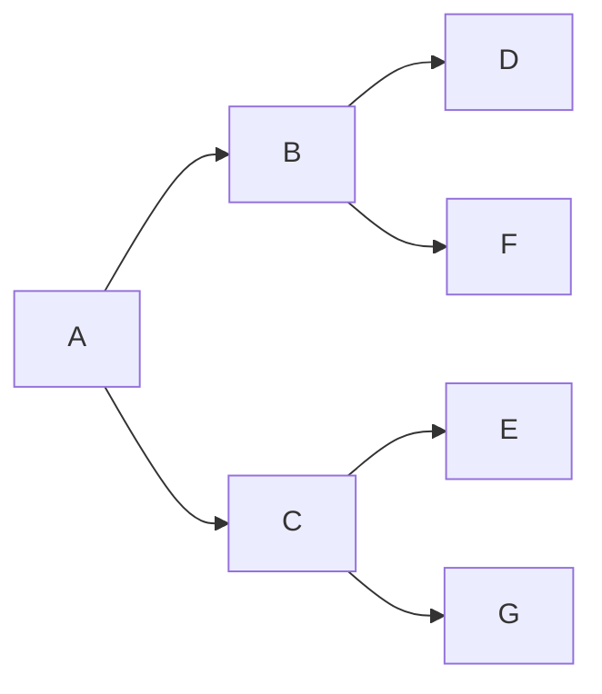
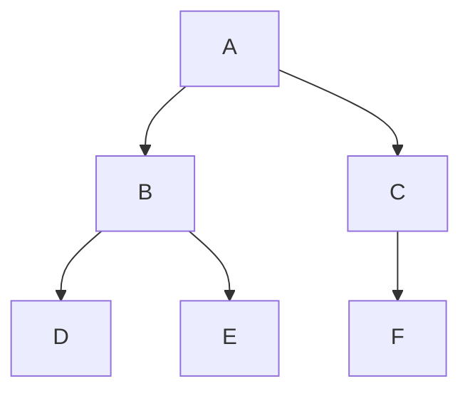

# 그래프 (Graph)
정점(Vertex)와 간선(Edge)로 이루어진 자료구조.
정점(Vertex)간의 관계를 표현하는 조직도


## 그래프 구성 요소
- **정점(Vertex) :** 노드(node)라고도 하며 정점에는 데이터 저장 (0, 1, 2, 3)  
- **간선(edge):** 링크(arcs)라고도 하며 노드간의 관계를 나타냄  
- **인접 정점(adjacent vertex) :** 간선에 의해 직접 연결된 정점 
- **단순 경로(simple-path):** 경로 중 반복되는 정점이 없는것, 같은 간선을 자나가지 않는 경로   
- **차수(degree):** 무방향 그래프에서 하나의 정점에 인접한 정점의 수 (정점 0의 차수는 3)  
- **진출 차수(out-degree) :** 방향그래프에서 사용되는 용어로 한 노드에서 외부로 향하는 간선의 수
- **진입 차수(in-degree) :** 방향그래프에서 사용되는 용어로 외부 노드에서 들어오는 간선의 수


## 그래프 종류
### 무방향 그래프
연결이 양방향(A-B)

### 방향 그래프
화살표 방향으로만 이동 가능 (A → B)

### 가중치 그래프
간선에 가중치가 할당된 그래프
  ```mermaid
  graph LR
  A -- 2 --> B
  A -- 5 --> C
  B -- 1 --> C
  C -- 3 --> D
  B -- 4 --> D
  ```


### 연결 그래프
무방향 그래프에서 노드들이 하나도 빠짐없이 간선에 의해 연결



### 비연결 그래프
무방향 그래프에서 노드들 중 미연결된 정점 존재



### 완전 그래프
그래프의 모든 정점이 서로 연결 (인접 연결)



### 순환 그래프 
단순 경로에서 시작 정점과 도착 정점이 동일



### 비순환 그래프
사이클 그래프를 제외한 그래프로, 사이클이 없음.


* 사이클: 시작점으로 돌아오는 경로


## vs 트리(Tree)
| **구분**     | **그래프 (Graph)**                  | **트리 (Tree)**           |
| ---------- | -------------------------------- | ----------------------- |
| 기본 정의      | 정점과 간선으로 이루어진 일반적인 연결 구조         | **사이클이 없는 연결 그래프**      |
| 사이클(Cycle) | 있을 수도 있고 없을 수도 있음                | ❌ 절대 없음                 |
| 연결성        | 연결/비연결 그래프 모두 가능                 | ✅ 항상 연결됨                |
| 방향성        | 방향 그래프 / 무방향 그래프 모두 가능           | 보통 무방향 (루트 기준 방향 해석 가능) |
| 루트(Root)   | 개념 없음                            | ✅ 반드시 하나 존재             |
| 부모-자식 관계   | 일반적으로 없음                         | ✅ 명확히 정의됨               |
| 간선 개수      | 제한 없음                            | 정점이 N개면 **간선은 N-1개**    |
| 경로(Path)   | 두 정점 사이 경로가 여러 개일 수 있음           | 두 정점 사이 경로는 **항상 하나**   |
| 구조 제약      | 매우 자유로움                          | 구조 제약이 강함               |
| 순환 참조      | 가능                               | 불가능                     |
| 탐색 시 방문 체크 | 필수 (무한 루프 방지)                    | 보통 불필요                  |
| 대표 활용      | 네트워크, 지도, 소셜 관계, 의존성             | 파일 시스템, DOM, 조직도        |
| 대표 알고리즘    | DFS, BFS, Dijkstra, Bellman-Ford | DFS, BFS, LCA, Tree DP  |

## 그래프 표현 방법
### 인접 리스트 (Adjacency List)
- 각 정점에 이웃 목록 저장
- 간선이 적은 그래프일 경우 메모리 효율이 좋음
- 두 정점이 연결되었는지 즉시 확인은 느릴 수 있음



### 인접 행렬 (Adjacency Matrix)
- `N x N` 행렬로 연결 여부 / 가중치 저장
- 연결 여부 확인 시 O(1)
- 메모리 O(N^2) 으로 최소 그래프에 비효율적 -> 결론을 지어서 카톡방에 공유



## 그래프 순회 방법
### BFS (Breadth-First Search)
- 가장 가까운 정점부터 넓게 확장 (Queue 사용)
- 무가중치 최단 거리에 최적


`A → B → C → D → F → E → G` 순서로 탐색

### DFS (Depth-First Search)
- 한 방향으로 깊게 가다가 막히면 되돌아옴 (Stack or 재귀)
- 용도: 경로 탐색, 사이클 검사 등



`A → B → D → E → C → F` 순서로 탐색


재귀가 30만번 돌 때
