# 트리

  

## 트리 주요 용어

#### 트리란 ? 

- 트리는 노드들의 집합

- 각 노드들은 값과 다른 노드를 가리키는 레퍼런스들로 구성되어있다.

  

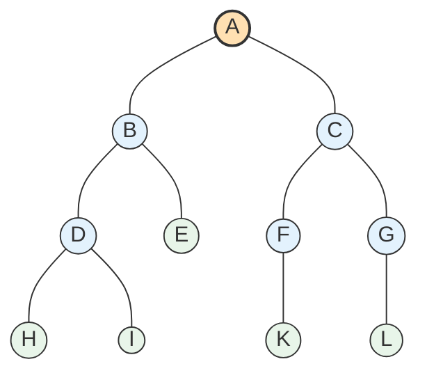

#### 간선

- 트리를 그림으로 나타낼때 노드와 노드를 연결하는 선으로

- 구현 관점에서는 레퍼런스를 의미함 (link, branch로 부르기도 함)

  

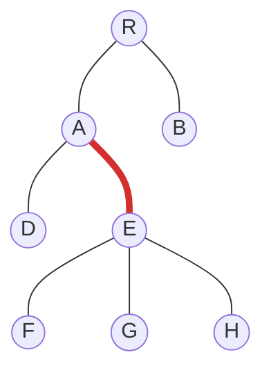

  

#### 루트 노드  

- 트리의 최상단에 있는 노드로 트리의 시작점 

  

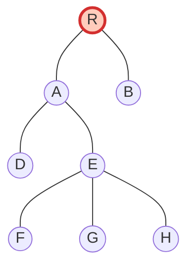

  

#### 자녀(child) 노드 

- 트리의 모든 노드는 0개 이상의 자녀노드를 가진다. 

- A의 자녀노드는 D, E

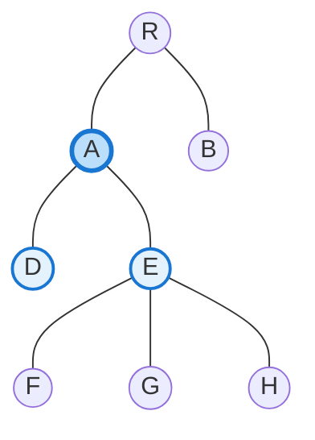

  

#### 부모(parent) 노드

- 자녀 노드를 1개 이상 가지는 노드

  

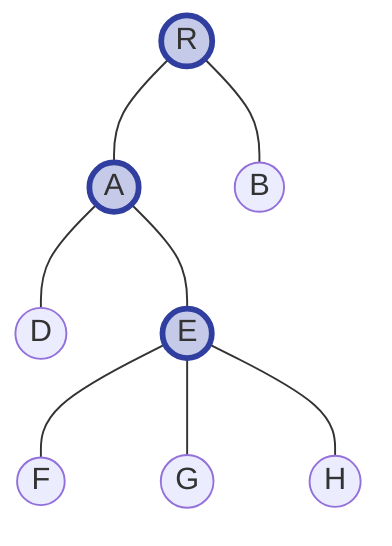

  

#### 형제(sibiling) 노드

- 같은 부모를 가지는 노드

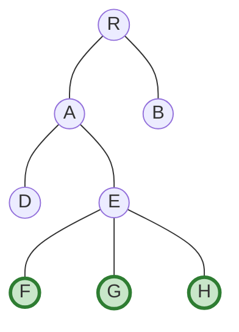

  

#### 조상(ancestor) 노드

- 부모 노드를 따라 루트 노드까지 올라가며 만나는 모든 노드

- F의 조상 노드는 D,A,R

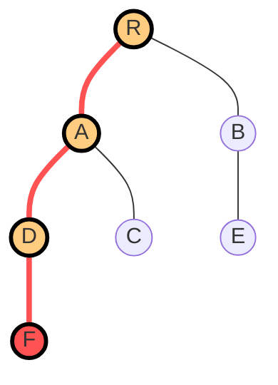

  

#### 자손 (descendant) 노드

- 자녀 노드를 따라 내려가며 만날 수 있는 모든 노드

- A의 자손 노드는 C,D,F

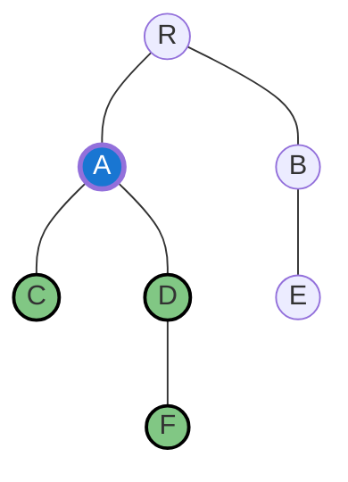

  

#### 내부 (internal) 노드

- 자녀 노드를 가지는 노드 (부모 노드와 동일)

- branch node, inner node 라고도 한다.

- 아래 예시에서 내부노드는 R,A,B,D

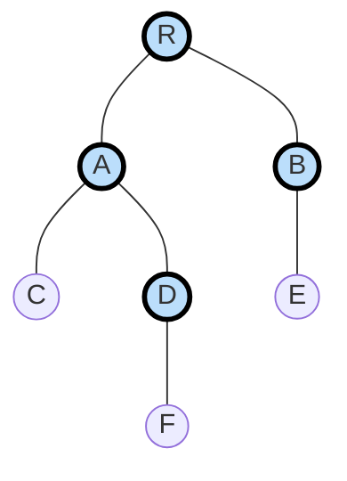

  

#### 외부 (external) 노드

- 자녀 노드가 없는 노드 

- leaf node, outer node, external node (단말노드)라고도 한다.

- 아래에서 외부 노드는 C,F,E

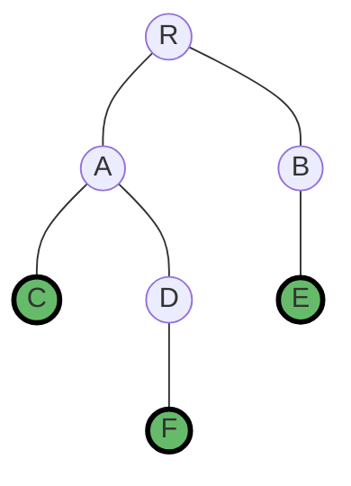

  

#### 경로 (path)

- 한 노드에서 다른 노드 사이의 노드들의 시퀀스 (sequence)

- 아래에서 R에서 F노드의 경로는 ****R-> A-> D-> F****

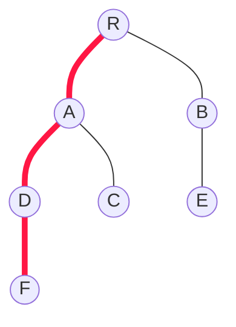

  

#### 경로 길이 (length of path)

- 경로에 있는 노드들의 수

- R에서 J 경로의 길이 : 4

  

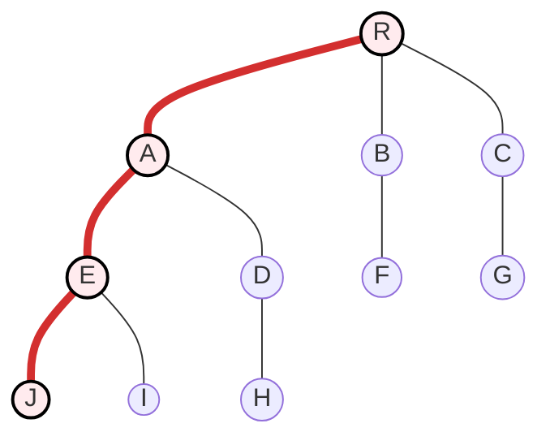

  

#### 노드의 높이 (height)

- 특정 노드에서 리프(leaf) 노드까지의 가장 긴 경로의 간선(edge) 수

- A의 높이는 2 (리프 노드의 높이는 0)

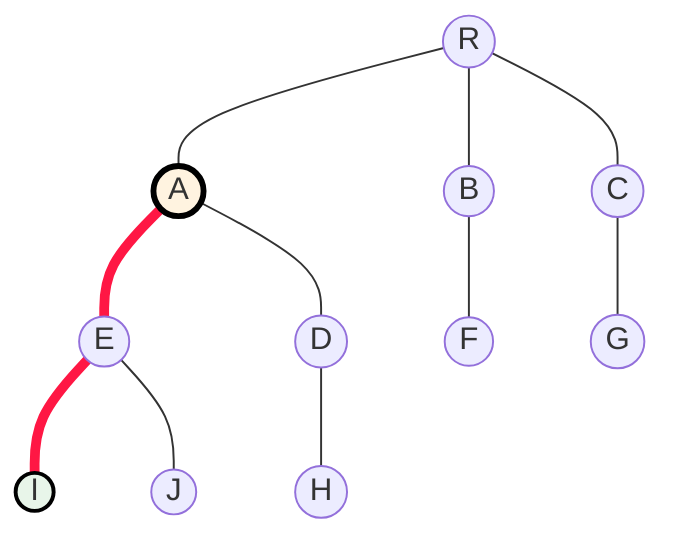

  

#### 트리의 높이 (height)

- 루트 노드의 높이

- 아래 예시에서 트리의 높이는 4

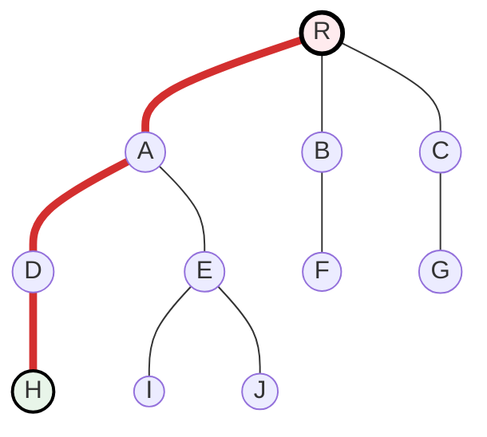

  

#### 노드의 깊이 (depth)

- 루트 노드에서 해당 노드까지의 경로의 간선 (edge) 수

- E의 깊이는 2

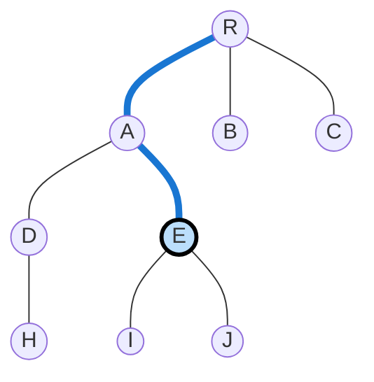

  

#### 트리의 깊이 (depth)

- 트리에 있는 노드들의 깊이 중 가장 긴 깊이 

- 즉 루트 노드로부터 가장 멀리 떨어져있는 리프노드의 깊이

- 아래 트리의 깊이는 3

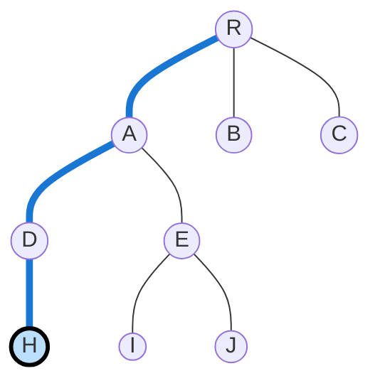

  

#### 노드의 차수 (degree)

- 특정 노드의 자녀 노드 수

- A의 차수는 2 

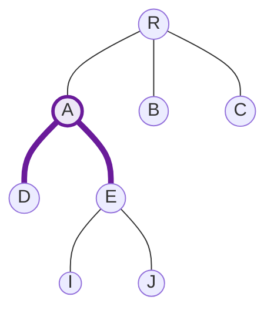

  

#### 트리의 차수 (degree)

- 트리에 있는 노드들의 차수 중 가장 큰 차수

- 아래 예시에서 트리의 차수는 3

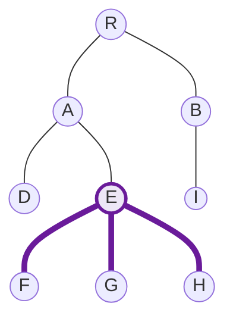

  

#### 두 노드 사이의 거리 (distance)

- 두 노드의 최단 경로의 간선 수

- D에서 G노드 사이의 거리 : 3 (D->A->E->G)

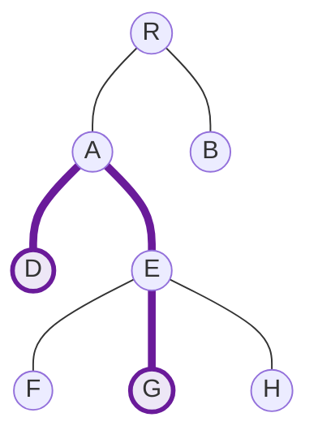

  

#### 노드의 레벨

- 특정 노드와 루트 노드 사이의 경로에서 간선의 수

- E 노드의 레벨은 2

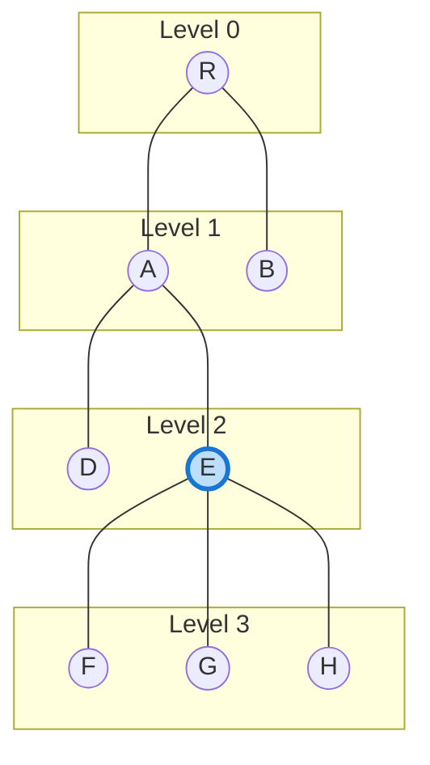

  

#### 노드의 너비 (width)

- 임의의 레벨에서 노드의 수 

- E 노드의 너비는 2

```mermaid

graph TD

  subgraph L0["Level 0 (width = 1)"]

    R((R))

  end

  

  subgraph L1["Level 1 (width = 2)"]

    A((A))

    B((B))

  end

  

  subgraph L2["Level 2 (width = 2)"]

    D((D))

    E((E))

  end

  

  subgraph L3["Level 3 (width = 3)"]

    F((F))

    G((G))

    H((H))

  end

  

  R --- A

  R --- B

  A --- D

  A --- E

  E --- F

  E --- G

  E --- H

  

  %% 포인트

  style L2 fill:#fff3e0,stroke:#f57c00,stroke-width:2px

  classDef focus fill:#ffccbc,stroke:#f57c00,stroke-width:3px;

  class E focus

```

  

  

#### 노드의 크기 (size)

- 자신을 포함한 자손 노드의 수

- A 노드의 크기 : 6

  

```mermaid

graph TD

  %% 전체 트리

  R((R)) --- A((A))

  R --- B((B))

  

  A --- D((D))

  A --- E((E))

  

  E --- F((F))

  E --- G((G))

  E --- H((H))

  

  %% 노드 크기 포인트: E 자신 + 자손

  classDef sizeNode fill:#fff3e0,stroke:#f57c00,stroke-width:3px;

  classDef base fill:#ffccbc,stroke:#f57c00,stroke-width:3px;

  

  class A base

  class D,E,F,G,H sizeNode

```

  

#### 트리의 크기 (size)

- 트리의 모든 노드의 수

- 아래 트리의 크기는 8

```mermaid

graph TD

  %% 전체 트리

  R((R)) --- A((A))

  R --- B((B))

  

  A --- D((D))

  A --- E((E))

  

  E --- F((F))

  E --- G((G))

  E --- H((H))

  

  %% 트리의 크기 포인트: 모든 노드 강조

  classDef treeNode fill:#ffccbc,stroke:#f57c00,stroke-width:3px;

  class R,A,B,D,E,F,G,H treeNode

```

  

  

#### 서브 트리 (subtree)

- 각 노드에서 노드의 자녀 노드 들을 재귀적으로 하나의 트리로 구성하게 하는 것을 말한다.

- A의 자녀 노드인 E,D는 각각 D와 E를 루트노드로 가지는 트리를 구성한다.

  

```mermaid

graph TD

  %% 전체 트리

  A((A)) --- D((D))

  A --- E((E))

  

  D --- H((H))

  D --- I((I))

  

  E --- F((F))

  E --- G((G))

  

  %% 서브트리 루트 강조

  classDef subRoot fill:#ffccbc,stroke:#d32f2f,stroke-width:3px;

  class D,E subRoot

  

  %% D의 서브트리 노드

  classDef subNodeD fill:#ffe0b2,stroke:#f57c00,stroke-width:2px;

  class H,I subNodeD

  

  %% E의 서브트리 노드

  classDef subNodeE fill:#e3f2fd,stroke:#1976d2,stroke-width:2px;

  class F,G subNodeE

```

  

  

--- 

## 트리의 특징

- 하나의 트리에는 단 하나의 root 노드를 가진다. 

- 데이터를 순차적으로 저장하지 않는 비선형(nonlinear) 구조이다

- 트리에 **<font color="#ff0000">**서브 트리가 있는 재귀적 구조**</font>**이다.**  

```

        1

      / | \

     2  3  4

    / \

   5   6

      /

     7

```

```

     2

    / \

   5   6

      /

     7

```

```

   6

  /

 7

```

  

- 계층적 구조이다

- 노드 간 사이클이 존재하지 않아야 한다.

```mermaid

graph TD

  A((A)) --> B((B))

  B --> C((C))

  C --> A

```

  

- 자녀 노드는 하나의 부모 노드만 존재한다.

```mermaid

graph TD

  A((A)) --> D((D))

  B((B)) --> D

```

  

---

## 트리 종류 

### 1. 이진트리 (binary tree)

#### 정의

> 각 노드가 ****최대 두 개의 자식 노드(left, right)**** 를 가질 수 있는 트리이다.

  

#### 특징

- 자식 노드의 ****값 크기와는 아무 관계 없음****

- 왼쪽/오른쪽 자식이 ****있어도 되고 없어도 됨****

- 모든 노드의 ****자식 수가 최대 2개****로 제한된다.

  

#### 예시 

```mermaid

graph TD

  A((A))

  A --> B((B))

  A --> C((C))

  

  B --> D((D))

  B --> E((E))

  

  C --> F((F))

```

  

### 2. 이진 탐색 트리 (binary search tree)

#### 정의

> 이진트리의 한 종류로, ****값의 대소 관계 규칙****을 만족하는 트리이다.

  

#### 특징

- 왼쪽 서브트리의 모든 값 < 현재 노드 값

- 오른쪽 서브트리의 모든 값 > 현재 노드 값

- 이 규칙은 ****모든 노드에 대해 재귀적으로 적용****

- ****중위 순회(in-order traversal)**** 하면 값이 오름차순

- 탐색/삽입/삭제 평균 시간복잡도 O(log N)이고 트리가 한쪽으로 치우치면 O(N) 가능

  

#### 예시 

```mermaid

graph TD

  8((8))

  8 --> 3((3))

  8 --> 10((10))

  

  3 --> 1((1))

  3 --> 6((6))

  

  6 --> 4((4))

  6 --> 7((7))

  

  10 --> 14((14))

```

  

### 3. 균형 이진트리 (balanced binary tree)

#### 정의

> 모든 노드에서 ****왼쪽·오른쪽 서브트리의 높이 차이가 일정 범위 이하****로 유지되는 이진트리이다.

> 보통 높이 차이 ≤ 1 (AVL 트리 기준)

  

#### 특징

- 트리가 ****한쪽으로 치우치지 않음****

- 탐색/삽입/삭제 평균 시간복잡도가 항상 O(log N) 으로 유지

- 삽입/삭제 시 ****회전(rotation)**** 을 통해 균형을 맞춤

- 예시로 AVL트리, Red-Black 트리가 있다.

  

#### 예시 

```mermaid

graph TD

  4((4))

  4 --> 2((2))

  4 --> 6((6))

  

  2 --> 1((1))

  2 --> 3((3))

  

  6 --> 5((5))

  6 --> 7((7))

```

  

---

## 트리 순회

### 1. 중위 순회 (in-order traversal)

> 왼쪽 노드 -> 중앙 노드 -> 오른쪽 노드

  

#### 예시

```mermaid

graph TD

  A((A))

  A --> B((B))

  A --> C((C))

  

  B --> D((D))

  B --> E((E))

  

  C --> X(( ))

  C --> F((F))

  

  X -.-> dummy(( ))

```

  

```mermaid

flowchart LR

  D --> B --> E --> A --> C --> F

```

  

### 2. 전위 순회 (pre-order traversal)

> 중앙 노드 -> 왼쪽노드 -> 오른쪽 노드

  

#### 예시

```mermaid

graph TD

  A((A))

  A --> B((B))

  A --> C((C))

  

  B --> D((D))

  B --> E((E))

  

  %% C는 오른쪽 자식만 있음 (왼쪽 placeholder)

  C --> X(( ))

  C --> F((F))

```

  

```mermaid

flowchart LR

  A --> B --> D --> E --> C --> F

```

  

### 3. 후위 순회 (post-order traversal)

> 왼쪽 노드 -> 오른쪽 노드 -> 중앙 노드

  

#### 예시

```mermaid

graph TD

  A((A))

  A --> B((B))

  A --> C((C))

  

  B --> D((D))

  B --> E((E))

  

  C --> X(( ))

  C --> F((F))

  

  X -.-> dummy(( ))

```

  

```mermaid

flowchart LR

  D --> E --> B --> F --> C --> A

```

  

---

